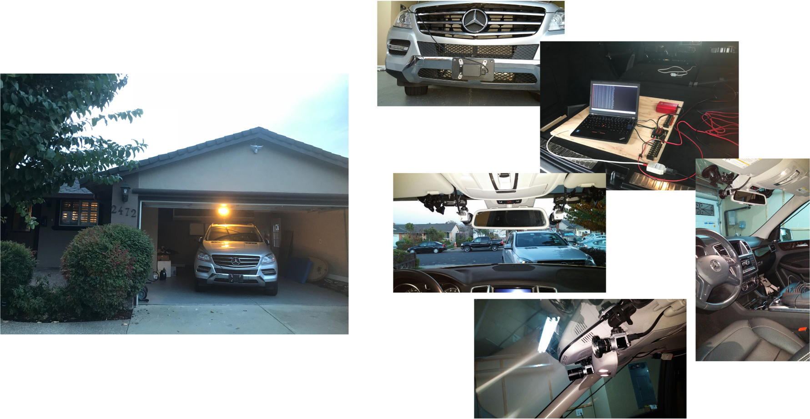
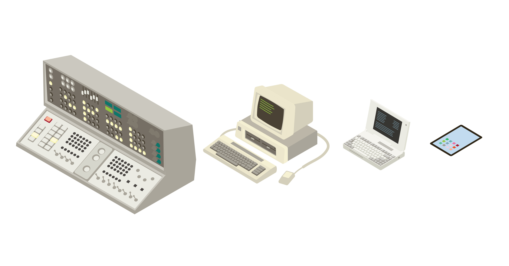
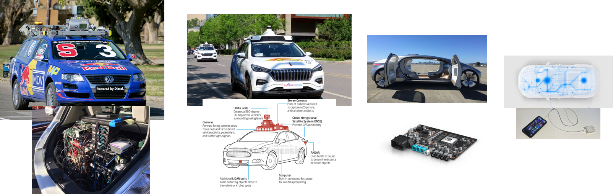
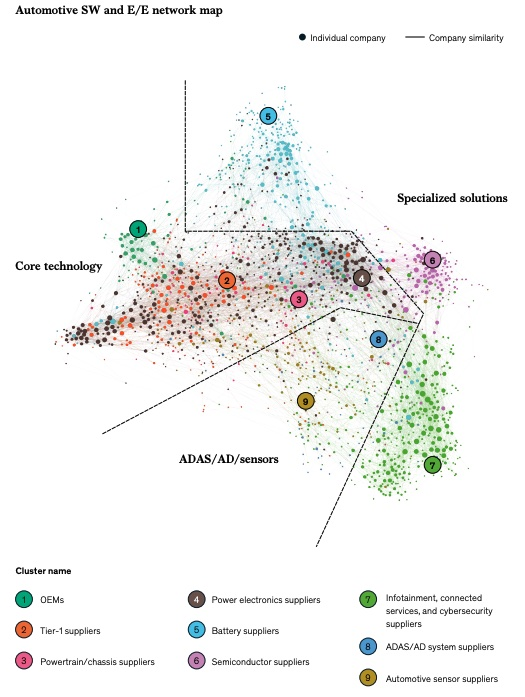

Autonomous Systems
==================

Autonomous driving (AD) poses unique challenges for complicated vehicle environments. The beautiful future of AD attracts distinguished teams and researchers, employing state-of-the-art technologies, such as deep learning, sensor fusion, extended object tracking, and high resolution sensor systems, to take the jewel in the crown of the AI/automotive industry.

.. _figPCHistory:

    Fig. 00: Perception Vehicle at Garage (Silicon Valley, CA)

Now it is universally acknowledged that the autonmous systems consist of four major components:

- Mapping & Localization,
- Environment Perception,
- Intelligent Planning,
- and DBW Control. 

However, the divided components are not really decoupled, resulting in extreme complex and bulky autonomous driving systems.

    Fig. 01: Brief History of PC

If we make a comparison with the **stone-age** PC industry (as shown in the Fig.01), it is not hard to conclude that the autonomous system nowaday is still at its early stage. 

Based on our deep domain knowledge and long-term experience in the AD society, we have predicted that a possible history of AD systems could be more or less like the one shown in Fig.02.

    Fig. 02: A Possible History of AD

No matter what, the technical difficulity of AD systems lies in the following `three fundamental aspects`_: 

#. data, 
#. algorithms, 
#. and computation.

Mckinsey once shows an automotive software and EE network map, reflecting the intriguing correlation of the three fundmantal aspects in current automotive industry.

    Fig. 03: `Automotive SW and EE Map`_.

.. admonition:: Data and Data Digitalization
    
   For an AD system, this is all about sensing systems for data accessing, data collection, data housing, data security, data serialization, data format, data interface and such.

   Customized sensor is the essence in the regard. 

   The major vehicle percpetion sensors are: 

   - mmwave radar, 
   - camera, 
   - and lidar. 

   Each has its own unique properties and supports different applications, due to different physical mechanisms.

    .. figure:: image/figSensorModality.jpg
        :align: center
        :alt: Automotive sensor functionalities.

        Fig. 04: `Sensor Modalities`_.

   We will particularly talk about the topic of automotive Radar perception systems. 
    
   The biggest challenge in the Data aspect lies in the data digitalization caused **sensor multi-modality**. This falls into the domain of `Heterogeneous Fusion`_. 

.. admonition:: Algorithms and Functionalities
    
   The algorithms directly reflects the four major components of an AD system. 

   1. Popular algorithms for the simultaneous localization and mapping (SLAM) problem can be found in the `OpenSLAM`_ page. 

    .. figure:: image/figSLAMTaxonomy.png
        :align: center
        :alt: Automotive sensor functionalities.

        Fig. 05: SLAM Taxonomy (courtesey of Dr. `Ramona Stefanescu`_).   

    In this regard, a de facto standard of the vehicle HD-Map systems is called `OpenDRIVE`_.  

   2. Sensor Fusion is the `Swiss Army Knife`_ for data digitalization. 

    .. figure:: image/figSFautoai.jpg
        :align: center
        :alt: SF importance

        Fig. 06: Sensor Fusion is considered the most important.   

    Nowadays, sensor fusion is considered as the bottleneck technology for realization of autonomous driving.
   
    How the sensor fusion theory originated from mainly aerospace scenarios can be applied to automative applications is the ultimate task I have been carrying out in the last decade. 

    We will have a comprehensieve and intensive discussion on the topic of sensor fusion later.

   3. Intelligence Planning is a fun topic but it would not be the focus of our         discussion.

   4. Drive-By-Wire Controller

    The most painful issue for developing an autonomous system for an algorithm researcher is to open an interface to communicating with vehicle.

    This is achieved by the so-called `drive by wire`_ (DBW) system.

    The DBW is nowadays essential for EV and AV systems. The EPS, EPB, iBoost, VCU and other systems have been integrated hardware units for vehicle control.

    4.1 EPS

    The EPS controls and assists with the support of an intelligent electric motor the vehicle steering. Based on the steering signal from the torque sensor, the control unit calculates the optimal steering support and sends the information to the electric motor to provide the necessary assistance.

    .. figure:: image/figEPS.png
        :align: center
        :alt: EPS

        Fig. 07: EPS Systems.      

    

    4.2 EPB

    An electronic parking brake (EPB), also known as an electric parking brake or electric park brake, is an electronically controlled parking brake, whereby the driver activates the holding mechanism with a button and the brake pads are electrically applied to the rear wheels.[1] This is accomplished by an electronic control unit (ECU) and an actuator mechanism. There are two mechanisms that are currently in production, Cable puller systems and Caliper integrated systems.[2] EPB systems can be considered a subset of Brake-by-wire technology.

    

    4.3 iBooster

    The iBooster can be used with all drivetrain configurations and is particularly suited to hybrid and electric vehicles. 

    The control principle behind the iBooster is similar to that of vacuum brake boosters: in vacuum brake boosters, a valve controls the air supply to provide a boost to the force applied from the driver‘s foot. With the iBooster, the actuation of the brake pedal is detected via an integrated differential travel sensor and this information is sent to the control unit. The control unit determines the control signals for the electric motor, while a three-stage gear unit converts the torque of the motor into the necessary boost power. The power supplied by the booster is converted into hydraulic pressure in a standard master brake cylinder.

    4.4 VCU
    
    The VCU coordinates the components in the powertrain or even assumes some of their functions. This includes control of the inverter and battery management system as well as transmission and engine control. Battery charging control (communication with the charging station via a standardized interface) can be integrated in the VCU as well.

    This facilitates the introduction of new functionalities, including interconnected functions, and saves resources in the subsidiary control units. In addition, the introduction of a new level of abstraction in the E/E architecture makes variant handling of changing powertrain components much easier.

    Due to its modular and configurable hardware and software, the vehicle control unit can be flexibly designed to meet future requirements. Two conceptions are available:

    The VCU Standard (VCU-S) uses resource-optimized technology based on the latest engine management generation. It is based on classic micro-controller technology and scalable to fit customer demands. The complexity in the chains of effect is significantly increased through the integration of cross-domain functionalities.

    The design of the VCU-S as an Embedded Integration Platform involves separate and independent partitions within the electronic control unit. As a result, it offers the necessary reduction of complexity, quick and easy integration and updates, legacy software integration, multipartner collaboration, mutually agreed safety concepts and much more.

    The VCU Performance (VCU-P) sets new standards in vehicle control. It is a departure from previous concepts. It uses micro-processor technology, up to several gigabytes of RAM and flash memory and simultaneous legacy SW support thanks to hypervisor and VRTE technology. The VCU-P also allows scalable feature expansion.

    Nowadays the DBW can be a standard unit for AD applications in differen scenarios. The detachment between driver and the car’s controls has been furthered by the introduction of DBW, yet more electrification of a once mechanical job.

    The challenge for autonomous system functionalities lies in the deeply coupled function compoents and algorithm accuracy/reliablity/real-time-ness. 

.. admonition:: Computational Capability and Units 
    
    The computional unit/processor is one of the most competitive lines in the industry. 

    NVidia stock is rocket high due to the high demands of computational capability for AD sensing data. 

    Xilinx tries to solve the issue from its speciality in SoC.

    NXP, 

    Horizon

    The challenge of AD computional complexity lies in limited bandwidth and high computational volume caused time latency.

-------------------------------------------------------------------------------------------------------------

.. _three fundamental aspects: https://www.163.com/dy/article/HAN5VFRG051193U6.html
.. _OpenDRIVE: https://www.asam.net/standards/detail/opendrive/
.. _OpenSLAM: https://openslam-org.github.io/
.. _Automotive SW and EE Map: https://www.mckinsey.com/~/media/mckinsey/industries/automotive%20and%20assembly/our%20insights/mapping%20the%20automotive%20software%20and%20electronics%20landscape%20through%202030/automotive-software-and-electronics-2030-final.pdf
.. _Swiss Army Knife: https://www.automationworld.com/process/sensors/article/21232617/sensor-fusion-the-swiss-army-knife-of-digitalization
.. _Sensor Modalities: https://www.mckinsey.com/industries/automotive-and-assembly/our-insights/rethinking-car-software-and-electronics-architecture
.. _Heterogeneous Fusion: https://link.springer.com/chapter/10.1007/978-3-662-44785-7_2
.. _Ramona Stefanescu: http://ramonastefanescu.com/#about
.. _Yaakov Bar Shalom: https://isif.org/events/workshop-estimation-tracking-and-fusion-tribute-yaakov-bar-shalom

.. _drive by wire: https://www.carthrottle.com/post/drive-by-wire-a-car-guys-judgement-day/

